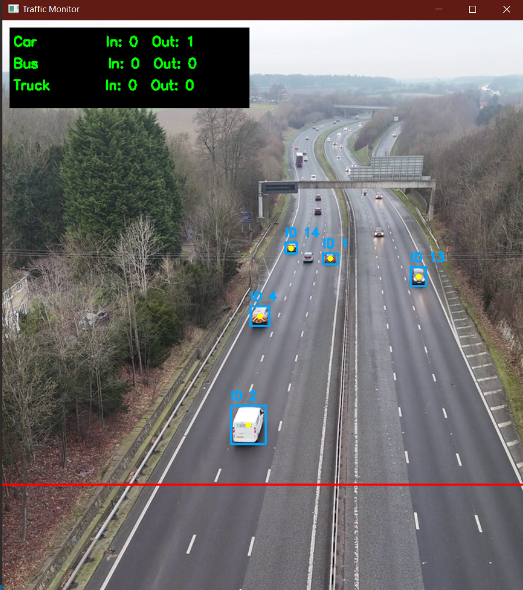
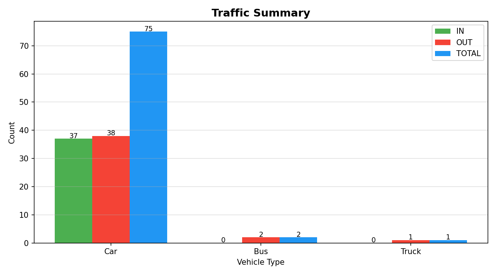

# Real-Time Traffic Vehicle Counter using YOLOv8

A computer vision project that counts vehicles crossing a line in real-time — built from scratch without relying on any high-level tracking libraries like Supervision.



## What it does

Point it at any traffic video and it will:
- Detect and track cars, buses, and trucks in real-time
- Count how many vehicles move **IN** and **OUT** across a virtual line
- Display a live dashboard on the video feed
- Show a clean **summary bar chart** once the video ends — useful for analyzing traffic load by vehicle type

---

## How it works

YOLOv8 handles detection and assigns persistent track IDs across frames. From there, everything is custom:

- A **horizontal counting line** is drawn at mid-frame
- Each vehicle's Y-center is tracked frame-by-frame, and a crossing is registered the moment it transitions from one side of the line to the other
- To handle large vehicles like trucks and buses that YOLOv8 sometimes detects twice, a **custom IOU-based duplicate removal** function was written — no external library, just plain geometry
- At the end, matplotlib renders an IN / OUT / TOTAL breakdown per vehicle type

No Supervision. No Roboflow utilities. Just YOLO + OpenCV + logic written by hand.

---

## Features

- Multi-class vehicle detection — Car, Bus, Truck
- Bidirectional counting (IN / OUT)
- Custom duplicate box removal using Intersection over Union (IOU)
- Live on-screen dashboard
- Post-video summary chart (also saved as `traffic_summary.png`)

---

##  Sample Output



---

##  Setup & Usage

```bash
pip install -r requirements.txt
python traffic_monitor.py
```

Point `video_path` in the script to your traffic video file and you're good to go.

---

##  Tech Stack

| Tool | Purpose |
|------|---------|
| YOLOv8 (Ultralytics) | Vehicle detection + tracking |
| OpenCV | Video processing, drawing |
| NumPy | Box math, IOU calculation |
| Matplotlib | Summary chart |

---

## Project Structure

```
traffic-monitor/
├── traffic_monitor.py
├── requirements.txt
├── README.md
└── assets/
    ├── demo.gif
    └── sample_summary.png
```

---

##  Why I built this ?

Most traffic counter tutorials just wrap everything inside the Supervision library — which is fine, but you don't really learn what's happening underneath. I wanted to understand the actual mechanics: how do you know a vehicle *crossed* a line? How do you avoid counting the same truck twice when the detector fires two boxes on it?

Building the counting and deduplication logic from scratch made this a much better learning experience, and honestly a more interesting project to talk about.
